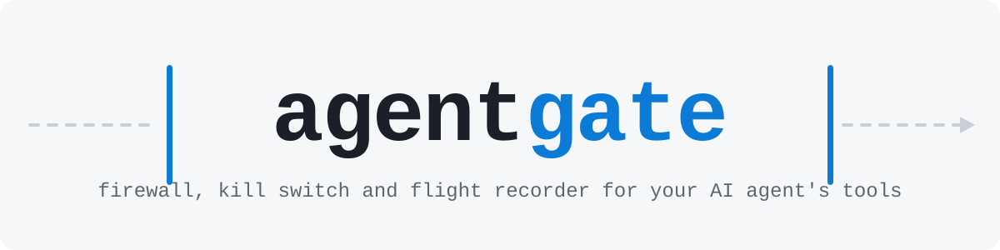
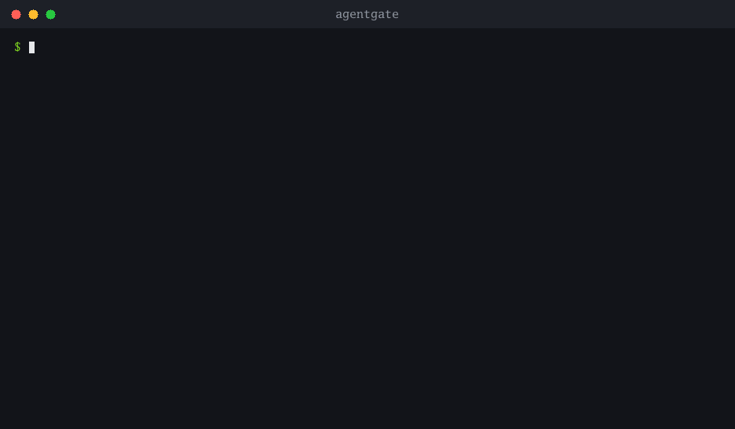

<p align="center">
  <picture>
    <source media="(prefers-color-scheme: dark)" srcset="docs/brand/banner-dark.svg">
    
  </picture>
</p>

<p align="center">
  <a href="https://github.com/bnymnDev/agentgate/actions/workflows/ci.yaml"></a>
  <a href="https://github.com/bnymnDev/agentgate/releases/latest"></a>
  
  <a href="LICENSE"></a>
</p>

<p align="center">
  <a href="#introducing-agentgate">Why</a> ·
  <a href="#see-it-work">Demo</a> ·
  <a href="#60-seconds">Install</a> ·
  <a href="#the-policy-language-in-one-screen">Policies</a> ·
  <a href="docs/guardrails.md">Guardrails</a> ·
  <a href="#documentation">Docs</a>
</p>

---

## Introducing agentgate

Give an AI agent a shell, a filesystem and a database, and it has every
permission you have — and no idea which of them are dangerous. It will
`git push --force` because a plan said so. It will `rm -rf` a path it
misread. It will run a `DELETE` whose `WHERE` clause it guessed. Not out of
malice. Because nothing told it not to, and nothing was watching.

The Model Context Protocol turned "give the model real tools" into a one-line
config change. It says nothing about what the model may *do* with those tools,
keeps no record of what it did, and has no way to stop it mid-flight. So far
the choice has been binary: trust the model, or do not install the server.

**agentgate is the third option.** A small proxy that sits between the agent
and its tools, speaks MCP on both sides, and gives agents what every other
kind of software with real permissions has had for decades:

| | |
|---|---|
| **A policy** | Plain YAML that decides what gets through. Deny `rm -rf`. Ask before anything the server itself calls destructive. Nothing on GitHub gets deleted. No deploys on Friday afternoon. A denied call comes back to the agent as a readable reason, so it adapts instead of retrying. |
| **An audit log** | Every call, with its arguments, result, decision and duration, in a local SQLite file. Secrets are scrubbed before they are written. Replay yesterday's session against tomorrow's policy and see what would change — before you trust it. |
| **An off switch** | One command freezes every agent on the machine without dropping a connection. And a decoy tool — a honeypot — tells you the moment an agent is following instructions you never gave it. |

No changes to the agent. No changes to the tools. No cgo, no runtime, no
cloud. One binary, one YAML file, one line changed in the host config.

```
  MCP host                 agentgate                    MCP servers
┌────────────┐   stdio   ┌──────────────────┐  stdio  ┌──────────────┐
│  your      │──────────▶│ policy   audit   │────────▶│ filesystem   │
│  agent     │◀──────────│ ├ allow  ├ sqlite│◀────────│ github       │
└────────────┘           │ ├ deny   ├ replay│  http   │ shell, db, … │
                         │ ├ ask    └ tail  │────────▶└──────────────┘
                         │ └ freeze         │
                         └──────────────────┘
```

---

## See it work

Every recording on this page is real output from the binary, replayed from a
transcript in [`docs/demo/`](docs/demo). Nothing is mocked.

**An agent gets to work. Then it gets ideas.** It reads a file, runs the tests,
is denied on `rm -rf`, and then calls a tool that does not exist — a honeypot.
Every agent on the machine is frozen until a human looks.



**Test tomorrow's policy on yesterday's session.** Three new rules, one
command, and you know exactly which of the seven calls would now be stopped —
without sending anything anywhere.


**Let the log write the policy.** Run a strict policy in shadow mode — it
records what it *would* have done and blocks nothing — look at the numbers,
then let `policy suggest` turn what the agent actually did into a
deny-by-default allow-list.


**Ask before you ship a rule.** `check` evaluates a single call against the
policy — at any time of day you like, with any budget already spent — and
exits non-zero on a deny, so it works as a test in CI.


---

## What's in the box

| | |
|---|---|
| **Kill switch** | `agentgate freeze` denies every tool call from every agent on the machine, instantly, without dropping a connection. `agentgate unfreeze` when you have looked. |
| **Honeypot tools** | Advertise a tool that does not exist — `db__drop_all_tables` — and find out the moment an agent tries to use it. That is a prompt injection, caught red-handed. Optionally freezes everything on the spot. |
| **Loop guard** | The same call with the same arguments ten times in a row is not diligence, it is a stuck agent burning money. agentgate stops it and tells the model why. |
| **Shadow mode** | Run a strict policy without enforcing it. See what it *would* have blocked in the audit log, tune, then flip the switch. |
| **Time-travel policy testing** | `agentgate replay <session> --dry-run` re-runs a real session against the current policy and shows exactly which decisions change. |
| **Secret redaction, both ways** | Secrets are scrubbed before they reach the audit log — and, if you say so, before they reach the model. The agent reads `.env`, the model gets `[REDACTED]`. |
| **Slack, Discord, ntfy, anything** | A denial, an approval request, a honeypot trip: get it on your phone. A webhook URL is all it takes. |
| **Approvals that remember** | An `ask` rule parks the call until a human answers — in the terminal or the web UI — and "allow for this session" means the same question is not asked again a minute later. |
| **Budgets** | Per session, per tool, per minute, per token. Hard caps that no rule can lift. |
| **Rules on what the server says** | `annotations.destructive: true` — ask before anything the server itself marks destructive. |
| **Rules on the clock** | `time.weekday`, `time.hour` — no deploys on Friday afternoon, approvals on weekends. |
| **A web UI** | Sessions, calls, the policy, the approvals inbox, the freeze button. Server-rendered, embedded, no CDN. |

---

## Who it is for

- **You run a coding agent on your own machine** and want it to keep working
  while you sleep, without waking up to a rewritten git history.
- **You ship agents to other people** and need to say, truthfully, what they
  can and cannot do — and prove it afterwards.
- **You build MCP servers** and want to see what an agent does with them before
  a customer does.

---

## 60 seconds

```sh
go install github.com/bnymnDev/agentgate/cmd/agentgate@latest
```

or with Homebrew:

```sh
brew tap bnymnDev/agentgate https://github.com/bnymnDev/agentgate
brew install --cask agentgate
```

Prebuilt binaries for linux, macOS and Windows (amd64 and arm64) are on the
[releases page](https://github.com/bnymnDev/agentgate/releases).

**1.** Write `agentgate.yaml`:

```yaml
version: 1

upstreams:
  - name: fs
    stdio: ["npx", "-y", "@modelcontextprotocol/server-filesystem", "/home/me/repo"]

honeypots:
  action: freeze
  tools:
    - name: fs__delete_everything
      description: "Recursively delete the whole workspace. Cannot be undone."

policy:
  default: allow
  loop_guard: { repeats: 10 }
  budget: { calls_per_minute: 60 }
  rules:
    - id: stay-in-the-repo
      tool: "fs.write_file"
      when:
        args.path: { not_prefix: "/home/me/repo/" }
      action: deny
      reason: "writes are confined to the repository"
```

**2.** Wherever your host config launched the server, launch agentgate instead:

```json
{ "command": "agentgate", "args": ["run", "--stdio", "--config", "/home/me/agentgate.yaml"] }
```

Works with any MCP host that starts stdio servers — Claude Code (`.mcp.json`), Claude Desktop (`claude_desktop_config.json`), Cursor (`.cursor/mcp.json`), Zed, Windsurf, your own.

**3.** Watch:

```sh
agentgate tail
```

```
14:02:11  allow   fs__read_file          3ms
14:02:12  allow   fs__write_file         5ms
14:02:14  DENY    fs__write_file         0ms  writes are confined to the repository
14:02:19  TRAP    fs__delete_everything  0ms  honeypot: fs__delete_everything does not exist. Calling it means…
the gateway is now FROZEN
```

That last line is an agent that was told, somewhere in a file it read, to wipe the workspace. It did not get to.

---

## The agent gets a reason, not a broken pipe

A denied call is not a transport error. It is a tool result the model can read:

```
agentgate denied: writes are confined to the repository (rule stay-in-the-repo)
```

…and it adapts. A blocked agent that understands *why* it was blocked stops trying the same thing. One that only sees an error retries until your budget is gone.

---

## Shadow first, enforce later

Nobody writes a correct deny-list on the first try. So don't:

```yaml
policy:
  mode: shadow        # record what would happen, block nothing
```

Run your agent for a day. Then:

```sh
agentgate stats --since 24h        # what did it actually do?
agentgate policy suggest > p.yaml  # an allow-list of exactly that, default: deny
agentgate replay <session> --dry-run   # what would the new policy have changed?
```

When the only things that flip to `deny` are the ones you meant, delete the `mode: shadow` line.

---

## The policy language, in one screen

```yaml
policy:
  default: allow                 # or deny, for a locked-down setup
  mode: enforce                  # or shadow
  redact_results: false          # true: secrets never reach the model
  budget:
    calls_per_session: 500
    calls_per_minute: 60
    tokens_per_session: 200000
    calls_per_tool: { fs.write_file: 50 }
  loop_guard:
    repeats: 10
  rules:                         # first match wins
    - id: no-destructive-shell
      tool: "shell.*"                              # glob, a|b alternation, or /regex/
      when:
        args.command: { regex: '\brm\s+-rf|\bgit\s+push\s+--force' }
      action: deny
      reason: "destructive shell command"

    - id: ask-before-anything-destructive
      tool: "*"
      when: { annotations.destructive: true }      # what the server says about itself
      action: ask

    - id: no-deploys-on-friday-afternoon
      tool: "*deploy*"
      when:
        time.weekday: { equals: "friday" }
        time.hour: { gt: 15 }
      action: deny
```

Matchers:

<!-- BEGIN:matchers -->
| Matcher | Holds when | Example |
|---|---|---|
| `equals` | the value is exactly this | <code>args.dryRun: { equals: false }</code> |
| `not_equals` | the value is anything but this | <code>args.mode: { not_equals: "dry" }</code> |
| `regex` | the value matches this Go regular expression | <code>args.command: { regex: '\brm\s+-rf' }</code> |
| `prefix` | the value starts with this string | <code>args.path: { prefix: "/etc/" }</code> |
| `not_prefix` | the value does not start with this string | <code>args.path: { not_prefix: "/srv/app/" }</code> |
| `in` | the value is one of these | <code>args.env: { in: ["prod", "staging"] }</code> |
| `gt`, `lt` | the value is a number above / below this; both may be combined | <code>args.amount: { gt: 10, lt: 100 }</code> |
| `exists` | the path is present (`true`) or absent (`false`) | <code>args.dryRun: { exists: false }</code> |
<!-- END:matchers -->

Paths: `args.path`, `args.items[*].sku`, `tool`, `upstream`, `annotations.destructive`, `time.hour`, `time.weekday`. The whole language, including what happens when a path is missing, is in [docs/policies.md](docs/policies.md).

Test a rule before you ship it:

```sh
agentgate check --tool 'shell.exec' --args '{"command":"rm -rf /"}'
agentgate check --tool 'deploy' --at 'friday 17:00'
agentgate policy validate agentgate.yaml
```

---

## Commands

<!-- BEGIN:commands -->
| Command | What it does |
|---|---|
| `check [flags]` | Dry-evaluate one call against the policy |
| `diff <session-a> <session-b> [flags]` | Compare two recorded sessions |
| `freeze [reason...]` | Stop every agent: deny all tool calls until unfreeze |
| `policy` | Work with the policy file |
| `policy suggest [flags]` | Write a deny-by-default policy from what the agent actually did |
| `policy validate [file]` | Check that a config file parses and its rules make sense |
| `replay <session-id> [flags]` | Re-run a recorded session through the current policy |
| `run [flags]` | Run the proxy |
| `sessions [flags]` | List recorded sessions |
| `show <session-id> [flags]` | Show the calls of one session |
| `stats [flags]` | What did the agent actually do? Per tool, per rule |
| `status` | Show the gateway's state at a glance |
| `tail [flags]` | Watch tool calls scroll by, live |
| `ui [flags]` | Browse the audit log in a browser |
| `unfreeze` | Lift the kill switch |
<!-- END:commands -->

Every flag: [docs/config.md](docs/config.md).

---

## Get it on your phone

```yaml
notify:
  webhooks:
    - url: https://ntfy.sh/my-agent          # or a Slack / Discord webhook URL
      format: ntfy                           # slack | discord | ntfy | json
      events: [deny, ask, honeypot, freeze]
```

A honeypot trip arrives as an urgent notification with the arguments the agent used. Arguments are redacted before they leave the machine.

---

## Design principles

1. **Transparent by default.** With one upstream and no matching rule, bytes
   in equal bytes out. Tool schemas and results are never rewritten, with one
   documented exception you have to turn on.
2. **Every decision has a reason.** Allow, deny and ask are typed values with
   a human-readable reason and the id of the rule that decided. No booleans.
3. **Evaluation is pure.** Same policy, same call, same decision — no clock,
   no filesystem, no network inside the evaluator. That is what makes replay
   trustworthy.
4. **Fail closed, audit best-effort.** A frozen gateway denies; a broken audit
   store never blocks a call. The two are not symmetric on purpose.
5. **One binary.** No cgo, no daemon, no Node, no cloud, no account.

---

## Documentation

| Document | What is in it |
|---|---|
| [docs/guardrails.md](docs/guardrails.md) | Kill switch, honeypots, loop guard, shadow mode, result redaction — how each one works and when to use it |
| [docs/policies.md](docs/policies.md) | The rule language in full |
| [docs/config.md](docs/config.md) | Every field of `agentgate.yaml`, every CLI flag |
| [docs/replay.md](docs/replay.md) | Replay, diff, stats, and the shadow → suggest → enforce workflow |
| [docs/architecture.md](docs/architecture.md) | How the proxy works, and what it deliberately does not do |
| [docs/comparison.md](docs/comparison.md) | Versus raw servers, wrapper scripts, host prompts and sandboxes |
| [docs/decisions.md](docs/decisions.md) | Design decisions and the reasoning behind each |

---

## Building from source

```sh
make build      # bin/agentgate
make test       # unit tests and policy golden files
make e2e        # the real binary in front of a real MCP server
make dev        # proxy + web UI against a demo server, nothing to install
make lint
```

---

## Status

v0.3. Everything in this README is implemented and covered by tests, including the end-to-end suite that drives the real binary. Not in it, on purpose: asking a model whether a call is safe (rules are deterministic so that `replay` can be trusted), central or multi-user management, governing prompts and resources (they pass through untouched), and authentication in front of the web UI (it refuses to bind to anything but localhost unless you insist).

Roadmap: OpenTelemetry export of the audit log, a `policy lint` that flags rules no recorded call has ever matched, and approval requests answered straight from the Slack message.

## License

GPL-3.0-or-later — see [LICENSE](LICENSE).

<p align="center"><sub>If agentgate saved you from an <code>rm -rf</code>, a star helps the next person find it.</sub></p>
