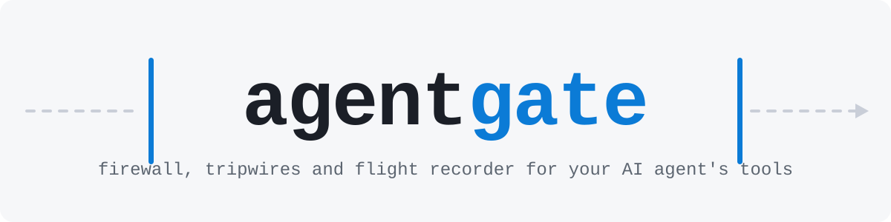
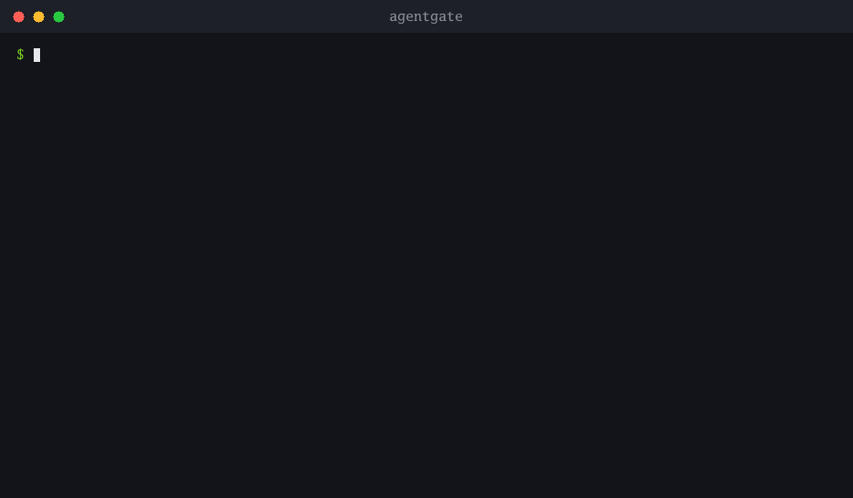

<p align="center">
  <picture>
    <source media="(prefers-color-scheme: dark)" srcset="docs/brand/banner-dark.svg">
    
  </picture>
</p>

<p align="center">
  <a href="https://github.com/bnymnDev/agentgate/actions/workflows/ci.yaml"></a>
  <a href="https://github.com/bnymnDev/agentgate/releases/latest"></a>
  
  <a href="https://goreportcard.com/report/github.com/bnymnDev/agentgate"></a>
  <a href="LICENSE"></a>
</p>

<p align="center">
  <a href="#introducing-agentgate">Why</a> ·
  <a href="#see-it-work">Demo</a> ·
  <a href="#60-seconds">Install</a> ·
  <a href="#whats-in-the-box">Features</a> ·
  <a href="#the-policy-language-in-one-screen">Policies</a> ·
  <a href="#documentation">Docs</a>
</p>

---

## Introducing agentgate

Give an AI agent a shell, a filesystem and a database, and it has every
permission you have — and no idea which of them are dangerous. It will
`git push --force` because a plan said so. It will `rm -rf` a path it
misread. It will run a `DELETE` whose `WHERE` clause it guessed. Not out of
malice. Because nothing told it not to, and nothing was watching.

And the tools talk back. The model reads every tool description as
instructions, and a server can change its descriptions long after you
installed it. A web page the agent fetches can carry orders in characters no
person can see. The agent reads your `.env` for a perfectly good reason, and
three calls later its contents are in a request body — base64-encoded, so
nothing that looks for secrets would notice.

The Model Context Protocol turned "give the model real tools" into a one-line
config change. It says nothing about what the model may *do* with those tools,
does not notice when the tools themselves change, keeps no record of what
happened, and has no way to stop it mid-flight. So far the choice has been
binary: trust the model and every server it talks to, or do not install them.

**agentgate is the third option.** A small proxy that sits between the agent
and its tools, speaks MCP on both sides, and does three things:

| | |
|---|---|
| **Stop** | A policy in plain YAML decides what gets through. Deny `rm -rf`. Ask before anything the server itself calls destructive. Send nothing anywhere once the session has read a page with hidden instructions in it. Start from reviewed packs, approve from your phone, and freeze every agent on the machine with one command. |
| **Detect** | Tripwires for what no policy anticipates. Tool definitions pinned in a lockfile, so a rug pull is held back before the model reads it. Poisoned descriptions caught by a scan. Fake credentials that are caught on their way out, however they are encoded. Decoy tools that no honest agent would ever call. |
| **Prove** | Every call — arguments, result, decision, reason — in a local log that is hash-chained, so an edit shows. Replay yesterday's session against tomorrow's policy, turn it into an offline test fixture, send it to your tracing, fail a CI job on it. |

No changes to the agent. No changes to the tools. No cgo, no runtime, no
cloud. One binary, one YAML file, and `agentgate init` does the wiring.

```
   MCP host                      agentgate                      MCP servers
┌──────────────┐   stdio   ┌──────────────────────────┐  stdio  ┌──────────────┐
│  your agent  │──────────▶│ STOP    policy · packs   │────────▶│ filesystem   │
│              │◀──────────│         ask · freeze     │◀────────│ github       │
└──────────────┘   http    │ DETECT  pins · canaries  │  http   │ shell, db, … │
                           │         bait · injection │────────▶└──────────────┘
                           │ PROVE   hash chain       │
                           │         replay · OTel    │
                           └──────────────────────────┘
```

---

## See it work

Every recording on this page is real output from the binary, replayed from a
transcript in [`docs/demo/`](docs/demo). Nothing is mocked.

**A web page tells the agent to leak your AWS keys.** The keys are a canary,
planted with one command. The agent reads them with its own file tool —
agentgate never sees that — fetches an issue whose page hides an instruction
in invisible Unicode, and mails the keys out, base64-encoded. The canary is
caught on its way out, the session can no longer send anything anywhere, and
the log proves what happened.



**A server you trusted ships an update.** Its search tool now tells the model
to read `~/.ssh/id_rsa` — in Unicode tag characters, which render as nothing
at all. The tool was pinned the day it was trusted, so the change is held
back before the model ever reads it, and the hidden text is spelled out.


**An agent gets to work. Then it gets ideas.** It reads a file, runs the
tests, is denied on `rm -rf`, and then calls a tool that does not exist — a
honeypot. Every agent on the machine is frozen until a human looks.


**Test tomorrow's policy on yesterday's session.** Three new rules, one
command, and you know exactly which of the seven calls would now be stopped —
without sending anything anywhere.


**Let the log write the policy.** Run a strict policy in shadow mode — it
records what it *would* have done and blocks nothing — look at the numbers,
then let `policy suggest` turn what the agent actually did into a
deny-by-default allow-list.


**Ask before you ship a rule.** `check` evaluates a single call against the
policy — at any time of day you like, with any budget already spent — and
exits non-zero on a deny, so it works as a test in CI.


---

## 60 seconds

```sh
brew tap bnymnDev/agentgate https://github.com/bnymnDev/agentgate
brew install --cask agentgate
```

or `go install github.com/bnymnDev/agentgate/cmd/agentgate@latest`, or a
prebuilt binary for linux, macOS or Windows from the
[releases page](https://github.com/bnymnDev/agentgate/releases), or the
container image `ghcr.io/bnymndev/agentgate`. Then:

```sh
agentgate init          # finds your MCP hosts, shows what it would change
agentgate init --yes    # puts agentgate in front of every server they use
```

```
HOST    STATUS  SERVERS             CONFIG
────    ──────  ───────             ──────
cursor  ready   filesystem, github  /home/me/.cursor/mcp.json

Cursor: 2 server(s) now behind agentgate, config /home/me/.agentgate/cursor.yaml
```

`init` knows Claude Desktop, Claude Code, Cursor, Windsurf, VS Code and
Gemini CLI. For each host it writes a config with the host's servers carried
over, the `baseline`, `secrets` and `lethal-trifecta` packs, tool pinning and
a honeypot — in **shadow mode**, so everything is recorded and nothing is
blocked yet — and it keeps the original entries byte for byte.
`agentgate uninstall` puts them back.

Restart the host, and watch:

```sh
agentgate tail   -c ~/.agentgate/cursor.yaml     # every call, live
agentgate doctor -c ~/.agentgate/cursor.yaml     # is everything in order?
```

When the shadow decisions look right, set `policy.mode: enforce`.

<details>
<summary><b>By hand, without <code>init</code></b></summary>

Write `agentgate.yaml`:

```yaml
version: 1

upstreams:
  - name: fs
    stdio: ["npx", "-y", "@modelcontextprotocol/server-filesystem", "/home/me/repo"]

honeypots:
  action: freeze
  tools:
    - name: fs__delete_everything
      description: "Recursively delete the whole workspace. Cannot be undone."

policy:
  default: allow
  packs: [baseline, secrets]
  rules:
    - id: stay-in-the-repo
      tool: "fs.write_file"
      when:
        args.path: { not_prefix: "/home/me/repo/" }
      action: deny
      reason: "writes are confined to the repository"
```

and wherever your host config launched the server, launch agentgate instead:

```json
{ "command": "agentgate", "args": ["run", "--config", "/home/me/agentgate.yaml"] }
```

That works with any MCP host that starts stdio servers — Claude Code,
Claude Desktop, Cursor, Zed, Windsurf, your own — and `agentgate run --http`
serves the ones that connect over HTTP.

</details>

---

## What's in the box

### Stop

| | |
|---|---|
| **A policy in YAML** | Rules on the tool, its arguments, what the server says about it, the time of day, the host, and what the session has done so far. First match wins. A denied call comes back to the agent as a reason it can read. |
| **Packs** | Reviewed rule sets, switched on by name: `baseline`, `secrets`, `lethal-trifecta`, `git-safety`, `github`, `database`, `filesystem`, `shell-strict`, `read-only`, `ask-destructive`, `business-hours`. Your own rules always come first. |
| **Session labels** | Facts a session picks up on its way — *read a web page*, *touched production*, *read a secret* — and rules that ask about them. That is how "never post anything after reading untrusted content" becomes one line. |
| **Approvals on your phone** | An `ask` rule parks the call and asks everywhere at once: the terminal, the web UI and your phone, with **Allow**, **Allow for session** and **Deny** buttons. First answer wins. |
| **Kill switch** | `agentgate freeze` denies every tool call from every agent on the machine, instantly, without dropping a connection. |
| **Loop guard and budgets** | The same call ten times in a row is a stuck agent burning money. Per session, per tool, per minute, per token: hard caps no rule can lift. |
| **Offer less** | `tools: [get_issue, "list_*"]` on an upstream: a tool that is not offered cannot be called, and its description never reaches the model. |

### Detect

| | |
|---|---|
| **Tool pinning** | Every tool definition is pinned in a lockfile on first sight. A server that later changes what a tool says is reported — or, with `enforce`, the tool is held back until you trust it. `agentgate lock` shows the diff. |
| **Poisoning scan** | Instructions hidden in invisible Unicode, text addressed to the model instead of describing the tool, pointers at `~/.ssh` and agent configs, one server's tool steering another's. |
| **Canaries** | `agentgate canary new` plants a fake AWS, GitHub, OpenAI or Stripe key. Nothing legitimate ever sends it anywhere, so a call that does is stopped — in plain text, base64, hex, URL-encoded or reversed. |
| **Injection in results** | A result with hidden text or instructions aimed at the model labels the session `injection-suspected`; `strip_invisible` takes the hidden characters out before the model reads them. |
| **Honeypots** | A decoy tool — `db__drop_all_tables` — that nothing legitimate calls. Calling it is a prompt injection caught red-handed, and can freeze everything on the spot. |
| **Live view** | `agentgate tail` in any terminal, and a web UI with a live page, the approvals inbox, the pinned tools and a trust button. |

### Prove

| | |
|---|---|
| **A hash-chained audit log** | Every call with its arguments, result, decision, reason and duration, in local SQLite, secrets scrubbed. Each call is chained to the one before it: `agentgate verify` proves nothing was edited, removed or reordered. |
| **Replay and diff** | `agentgate replay <session> --dry-run` runs a real session through the current policy and shows exactly which decisions change. |
| **Mock servers** | `agentgate mock <session>` serves a recorded session as an MCP server — the same tools, the recorded answers, nothing real behind it. A repeatable, offline fixture. |
| **OpenTelemetry** | One trace per session, one span per call, over OTLP to Jaeger, Tempo, Honeycomb, Datadog or anything else that speaks it. |
| **Policy tests** | `agentgate test` runs the calls a policy must stop and the ones it must let through — with the session each is made in — and fails CI when a change to a rule or a pack breaks one. `--from <session>` turns a recorded session into a test, so a good day of work becomes the regression suite. |
| **CI** | A GitHub Action that installs, lints and runs the policy tests, and one that writes what the agent did to the job summary and fails the job on a canary, a honeypot or a quarantined tool. |
| **Webhooks** | Slack, Discord, ntfy or plain JSON, for denials, questions, honeypots, drift, exfiltration and injection. |

---

## The agent gets a reason, not a broken pipe

A denied call is not a transport error. It is a tool result the model can read:

```
agentgate denied: writes are confined to the repository (rule stay-in-the-repo)
```

…and it adapts. A blocked agent that understands *why* it was blocked stops
trying the same thing. One that only sees an error retries until your budget
is gone.

---

## Shadow first, enforce later

Nobody writes a correct deny-list on the first try. So don't:

```yaml
policy:
  mode: shadow        # record what would happen, block nothing
```

Run your agent for a day. Then:

```sh
agentgate stats --since 24h            # what did it actually do?
agentgate policy suggest > p.yaml      # an allow-list of exactly that, default: deny
agentgate replay <session> --dry-run   # what would the new policy have changed?
agentgate policy lint                  # rules that never fire, allows that let too much through
agentgate test                         # and the calls it must never let through, as tests
```

When the only things that flip to `deny` are the ones you meant, delete the
`mode: shadow` line.

---

## The policy language, in one screen

```yaml
policy:
  default: allow                 # or deny, for a locked-down setup
  mode: enforce                  # or shadow
  packs:                         # reviewed rule sets; your rules come first
    - baseline
    - lethal-trifecta
    - name: filesystem
      with: { workspace: /home/me/repo }
  budget:
    calls_per_session: 500
    calls_per_minute: 60
    tokens_per_session: 200000
  loop_guard:
    repeats: 10
  labels:                        # facts a session picks up on its way
    - label: tests-passed
      tool: "shell.test"
      when: { result.is_error: false }
  rules:                         # first match wins
    - id: no-destructive-shell
      tool: "shell.*"                              # glob, a|b alternation, or /regex/
      when:
        "args.{command,cmd}": { regex: '\brm\s+-rf|\bgit\s+push\s+--force' }
      action: deny
      reason: "destructive shell command"

    - id: deploy-only-after-green-tests
      tool: "shell.deploy"
      when: { session.label.tests-passed: false }
      action: deny
      reason: "run the tests, and make them pass, before deploying"

    - id: ask-before-anything-destructive
      tool: "*"
      when: { annotations.destructive: true }      # what the server says about itself
      action: ask

    - id: no-deploys-on-friday-afternoon
      tool: "*deploy*"
      when:
        time.weekday: { equals: "friday" }
        time.hour: { gt: 15 }
      action: deny
```

Matchers:

<!-- BEGIN:matchers -->
| Matcher | Holds when | Example |
|---|---|---|
| `equals` | the value is exactly this | <code>args.dryRun: { equals: false }</code> |
| `not_equals` | the value is anything but this | <code>args.mode: { not_equals: "dry" }</code> |
| `regex` | the value matches this Go regular expression | <code>args.command: { regex: '\brm\s+-rf' }</code> |
| `not_regex` | the value does not match this regular expression | <code>args.sql: { not_regex: '(?i)\bwhere\b' }</code> |
| `prefix` | the value starts with this string | <code>args.path: { prefix: "/etc/" }</code> |
| `not_prefix` | the value does not start with this string | <code>args.path: { not_prefix: "/srv/app/" }</code> |
| `in` | the value is one of these | <code>args.env: { in: ["prod", "staging"] }</code> |
| `gt`, `lt` | the value is a number above / below this; both may be combined | <code>args.amount: { gt: 10, lt: 100 }</code> |
| `exists` | the path is present (`true`) or absent (`false`) | <code>args.dryRun: { exists: false }</code> |
| `includes` | one of the values — or one item of a list among them — is exactly this | <code>session.labels: { includes: private-data }</code> |
| `excludes` | no value, and no item of a list among them, is this; also holds when there is none | <code>session.called: { excludes: shell.test }</code> |
<!-- END:matchers -->

Paths: `args.path`, `args.items[*].sku`, `"args.{command,cmd}"`, `tool`,
`upstream`, `annotations.destructive`, `time.hour`, `host.name`,
`session.label.<name>`, `session.called`. The whole language, including what
happens when a path is missing, is in [docs/policies.md](docs/policies.md).

Test a rule before you ship it — once, with `check`:

```sh
agentgate check --tool 'shell.exec' --args '{"command":"rm -rf /"}'
agentgate check --tool 'deploy' --at 'friday 17:00'
agentgate check --tool 'mail.send' --label untrusted-input --label private-data
```

— or for good, in `agentgate.test.yaml`, which `agentgate test` runs and CI
fails on:

```yaml
tests:
  - name: rm -rf / is denied
    call: { tool: shell.exec, args: { command: "rm -rf /" } }
    expect: deny

  - name: deploys only after green tests
    before:
      - { tool: shell.test, result: { is_error: false } }
    call: { tool: shell.deploy }
    expect: allow
```

---

## Everywhere the agent runs

**Approvals on your phone.** Through [ntfy](https://ntfy.sh) — the public
server or your own — with nothing listening on a port:

```yaml
approval:
  ntfy:
    topic: agentgate-7f3a9c2e41b8d605     # on ntfy.sh the topic name is the password
```

**In CI.** An agent in a workflow has the same tools and nobody watching:

```yaml
- uses: bnymnDev/agentgate@v0.4.0
  with:
    config: .github/agentgate.yaml       # validated, linted, its tests run

# ... the agent runs, its MCP servers behind agentgate ...

- uses: bnymnDev/agentgate/report@v0.4.0
  if: always()
  with:
    config: .github/agentgate.yaml
    fail-on: canary>0,honeypot>0,quarantine>0
```

**In a container.** `ghcr.io/bnymndev/agentgate` is the binary alone on
distroless, non-root, for amd64 and arm64.

**In your dashboards.** `OTEL_EXPORTER_OTLP_ENDPOINT=http://localhost:4318` and
every call is a span.

All of it in [docs/integrations.md](docs/integrations.md).

---

## Commands

<!-- BEGIN:commands -->
| Command | What it does |
|---|---|
| `canary` | Plant fake credentials and catch them leaving |
| `canary list [flags]` | List the canaries |
| `canary new [flags]` | Create a canary, and optionally the decoy file that holds it |
| `canary rm <id-or-label> [flags]` | Retire a canary |
| `check [flags]` | Dry-evaluate one call against the policy |
| `diff <session-a> <session-b> [flags]` | Compare two recorded sessions |
| `doctor [flags]` | Check that everything agentgate depends on is in order |
| `freeze [reason...]` | Stop every agent: deny all tool calls until unfreeze |
| `init [flags]` | Put agentgate in front of the MCP servers your hosts already use |
| `lock [flags]` | Review and trust the tool definitions pinned in the lockfile |
| `mock <session-id> [flags]` | Serve a recorded session as a stand-in MCP server |
| `policy` | Work with the policy file |
| `policy add <pack> [flags]` | Switch a policy pack on in the config file |
| `policy lint [file] [flags]` | Find rules that never fire or let more through than they seem to |
| `policy pack <name>` | Show a policy pack: what it does, its parameters and its rules |
| `policy packs` | List the policy packs that ship with agentgate |
| `policy remove <pack>` | Switch a policy pack off in the config file |
| `policy suggest [flags]` | Write a deny-by-default policy from what the agent actually did |
| `policy validate [file]` | Check that a config file parses and its rules make sense |
| `replay <session-id> [flags]` | Re-run a recorded session through the current policy |
| `run [flags]` | Run the proxy |
| `sessions [flags]` | List recorded sessions |
| `show <session-id> [flags]` | Show the calls of one session |
| `stats [flags]` | What did the agent actually do? Per tool, per rule |
| `status` | Show the gateway's state at a glance |
| `tail [flags]` | Watch tool calls scroll by, live |
| `test [file...] [flags]` | Run the policy tests: calls, and the decisions they have to get |
| `ui [flags]` | Browse the audit log in a browser |
| `unfreeze` | Lift the kill switch |
| `uninstall [host...] [flags]` | Take agentgate out from in front of a host's MCP servers |
| `verify [flags]` | Prove the audit log has not been edited |
<!-- END:commands -->

Every flag: [docs/config.md](docs/config.md).

---

## Design principles

1. **Transparent by default.** With one upstream and no matching rule, bytes
   in equal bytes out. Tool schemas and results are never rewritten, except by
   the two options that say so and are off by default.
2. **Every decision has a reason.** Allow, deny and ask are typed values with
   a human-readable reason and the id of the rule that decided. No booleans.
3. **Evaluation is pure.** Same policy, same call, same session history, same
   decision — no clock, no filesystem, no network inside the evaluator. That
   is what makes replay trustworthy.
4. **Fail closed, audit best-effort.** A frozen gateway denies; a broken audit
   store never blocks a call. The two are not symmetric on purpose.
5. **One binary.** No cgo, no daemon, no Node, no cloud, no account.

---

## Documentation

| Document | What is in it |
|---|---|
| [docs/guardrails.md](docs/guardrails.md) | Kill switch, honeypots, tool pinning, the poisoning scan, canaries, injection, the lethal trifecta, approvals, the hash chain — how each works and when to use it |
| [docs/policies.md](docs/policies.md) | The rule language in full: selectors, matchers, labels, packs, lint, tests |
| [docs/config.md](docs/config.md) | Every field of `agentgate.yaml`, every CLI flag |
| [docs/integrations.md](docs/integrations.md) | `init`, `doctor`, the GitHub Action, containers, OpenTelemetry, `mock`, your phone |
| [docs/replay.md](docs/replay.md) | Replay, diff, stats, and the shadow → suggest → enforce workflow |
| [docs/architecture.md](docs/architecture.md) | How the proxy works, and what it deliberately does not do |
| [docs/comparison.md](docs/comparison.md) | Versus raw servers, wrapper scripts, host prompts and sandboxes |
| [docs/decisions.md](docs/decisions.md) | Design decisions and the reasoning behind each |

---

## Building from source

```sh
make build      # bin/agentgate
make test       # unit tests and policy golden files
make e2e        # the real binary in front of a real MCP server
make dev        # proxy + web UI against a demo server, nothing to install
make lint
```

Contributions are welcome; see [CONTRIBUTING.md](CONTRIBUTING.md) for the
workflow and [SECURITY.md](SECURITY.md) for how to report a vulnerability.
Changes between releases are listed in [CHANGELOG.md](CHANGELOG.md).

---

## Status

v0.4. Everything in this README is implemented and covered by tests,
including the end-to-end suite that drives the real binary. Not in it, on
purpose: asking a model whether a call is safe (rules are deterministic so
that `replay` can be trusted), central or multi-user management, governing
prompts and resources (they pass through untouched), and authentication in
front of the web UI (it refuses to bind to anything but localhost unless you
insist).

Next: approvals answered straight from a Slack message, and shared lockfiles
for popular servers, so a definition can be checked against what everyone
else pinned.

## License

GPL-3.0-or-later — see [LICENSE](LICENSE).

<p align="center"><sub>If agentgate caught something for you, a star helps the next person find it.</sub></p>
